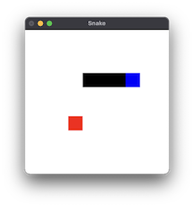

# snake-using-gloss-demo

Just a quick demo of the Snake game to get familiar with the [gloss](https://hackage.haskell.org/package/gloss) library.

## Quick start

> cabal run

## License

Public domain (see the `UNLICENSE` file.)

